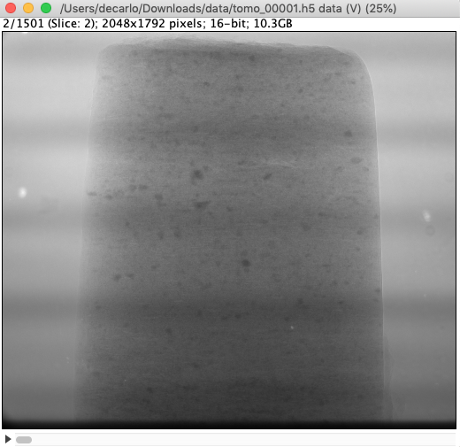
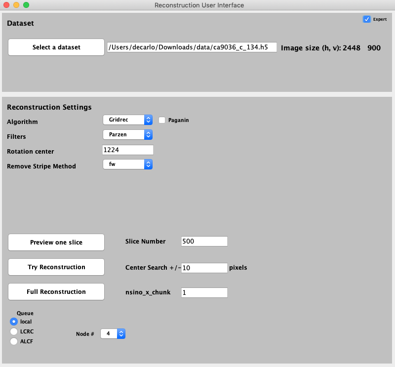

=========
tomopy-ij
=========

tomopy-ij provides ImageJ support to `tomopy  <https://tomopy.readthedocs.io>`_.

tomopy-ij is derived from the `TOMCAT recomanager <https://github.com/xray-imaging/recomanager/tree/f308766a9c163333ceac93fa80996b77e50e98de>`_ 
developed by Federica Marone at the Swiss Light Source as described `here <https://doi.org/10.1186/s40679-016-0035-9>`_ and it is customized to provide similar functionality to the APS beamlines using `tomoScan <https://tomoscan.readthedocs.io/>`_.

Installation
------------

First, you must have `Conda <https://docs.conda.io/en/latest/miniconda.html>`_
and `Fiji <https://imagej.net/software/fiji/>`_ with the 
`PSI hdf plugin <https://github.com/paulscherrerinstitute/ch.psi.imagej.hdf5>`_ installed.
Next install `tomopy  <https://tomopy.readthedocs.io/en/latest/install.html#installing-from-conda>`_:

::

    $ conda create --name tomopy --channel conda-forge tomopy

and activate this environment with::

    $ conda activate tomopy

then install `dxchange <https://dxchange.readthedocs.io/>`_: 

::

    $ conda install -c conda-forge dxchange

and install `tomopy cli <https://tomopycli.readthedocs.io/en/latest/source/install.html>`_

::

    $ git clone https://github.com/tomography/tomopy-cli.git
    $ cd tomopy-cli
    $ python setup.py install

Finally

::

    $ cd your_working_directory
    $ git clone https://github.com/xray-imaging/tomopy_ij.git

Modify tomopy_ij.py sys.path.append() to point to:

::

    sys.path.append('your_working_directory/tomopy-ij/tomopy_ij')

Usage
-----

Locate the installation directory of the Fiji application (`FIJI_DIR`) and start Fiji from the same terminal where the tomopy conda env has been activated::

    $ (`FIJI_DIR`)/Contents/MacOS(*)/ImageJ-macosx 
    
(*) folder name will match the Operative System of your installation.

then File/Open and select the tomopy_ij/tomopy_ij.py and hit run:

.. image:: docs/source/img/tomopy_ij_run.png
    :width: 25%
    :align: center

to obtain the main tomopy_ij control screen:

.. image:: docs/source/img/tomopy_ij.png
    :width: 30%
    :align: center

Once you select a valid tomographic data set the projection data will be displayed in ImageJ as a stack:

Select Expert or Paganin to access additional parameters:

.. image:: docs/source/img/tomopy_ij_paganin.png
    :width: 25%
    :align: center

Press preview, try of full to reconstruct your data set:

.. image:: docs/source/img/tomo_ij_recon.png
    :width: 30%
    :align: center
