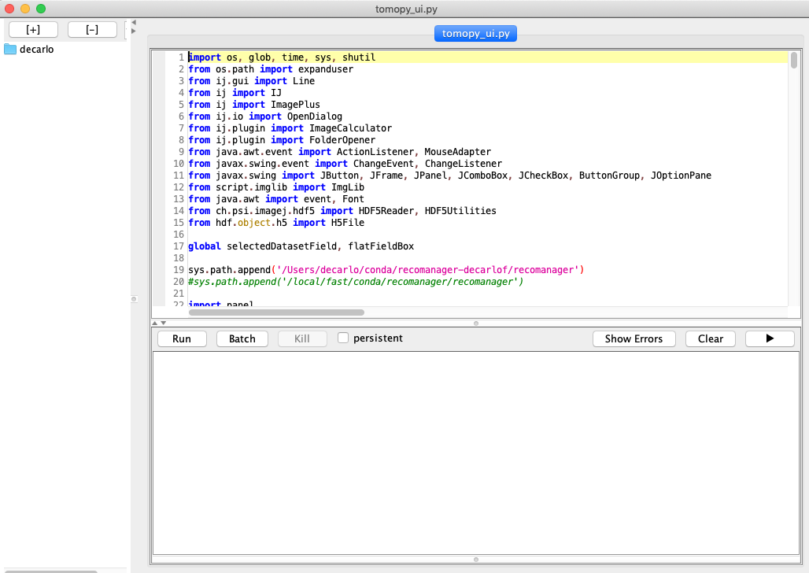
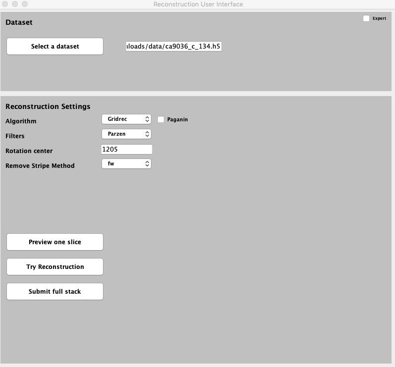
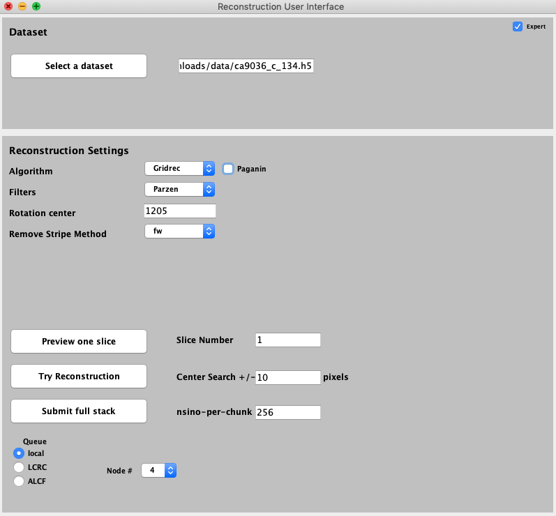
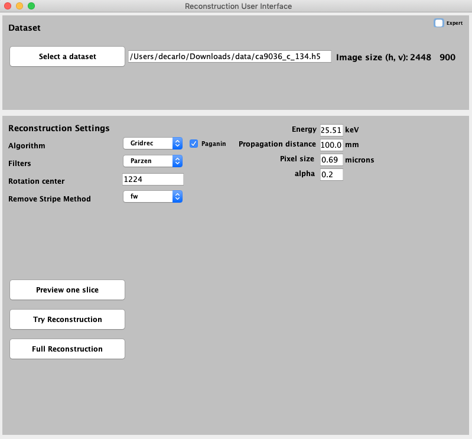

=========
tomopy-ui
=========

tomopy-ui provides ImageJ support to `tomopy  <https://tomopy.readthedocs.io>`_

Installation
------------

First, you must have `Conda <https://docs.conda.io/en/latest/miniconda.html>`_
installed and `Fiji <https://imagej.net/software/fiji/>`_ with the 
`hdf plugin <https://github.com/paulscherrerinstitute/ch.psi.imagej.hdf5>`_ installed.

Next install `tomopy  <https://tomopy.readthedocs.io/en/latest/install.html#installing-from-conda>`_

::

    $ conda create --name tomopy --channel conda-forge tomopy

and activate this environment with::

    $ conda activate tomopy

then install `dxchange <https://dxchange.readthedocs.io/>`_ 

::

    $ conda install -c conda-forge dxchange

Finally

    $ cd your_working_directory
    $ git clone https://github.com/xray-imaging/tomopy_ui.git

Modify tomopy_ui.py sys.path.append() to point to:
::

    sys.path.append('your_working_directory/tomopy_ui')

Usage
-----

Start Fiji then File/Open and select the tomopy_ui/tomopy_ui.py and hit run:

to obtain the main tomopy_ui control screen:

Once you select a valid tomographic data set the projection data will be displayed:

.. image:: docs/source/img/read_data.png
    :width: 15%
    :align: center

Select Expert or Paganin to access additional parameters:

Press preview, try of full to reconstuct your data set:

.. image:: docs/source/img/tomo_ui_recon.png
    :width: 30%
    :align: center